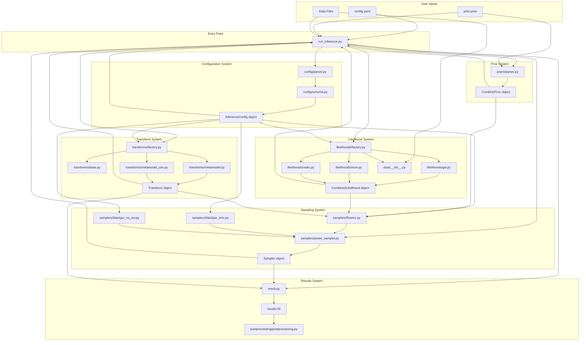
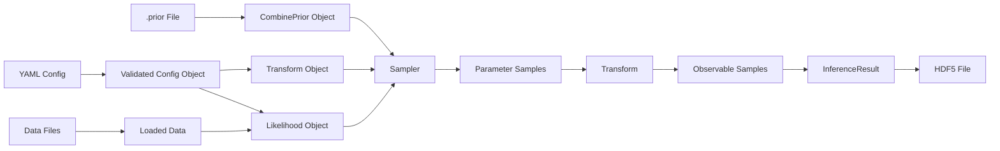
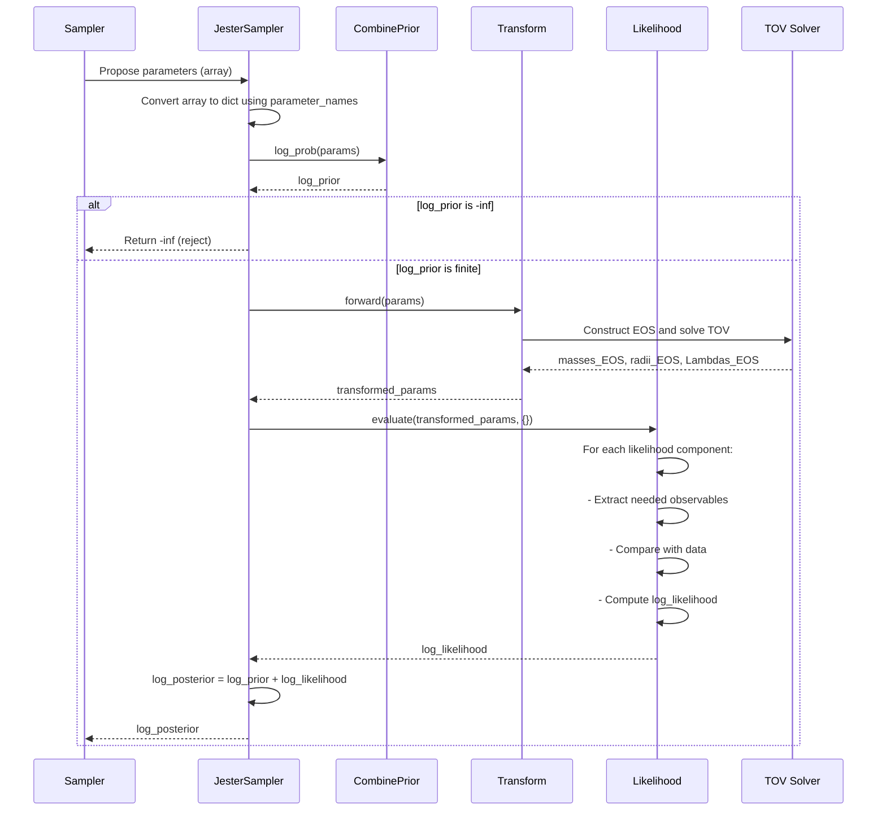
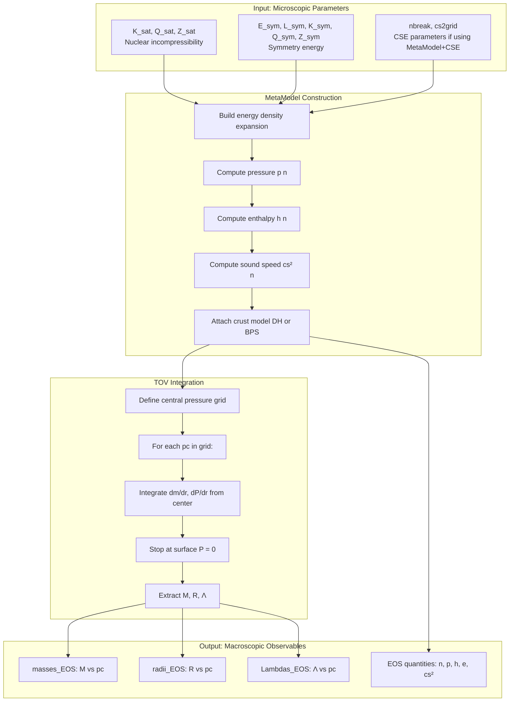

# JESTER Inference Workflow: A Developer's Guide

This guide explains how the JESTER inference system works from a file-level perspective, showing how different components connect and how data flows through the system. This is intended for developers who want to understand the implementation or extend the system.

## Table of Contents

1. [Overview](#overview)
2. [File Structure and Connections](#file-structure-and-connections)
3. [Data Flow Through the System](#data-flow-through-the-system)
4. [Understanding the Main Components](#understanding-the-main-components)
5. [Step-by-Step Execution](#step-by-step-execution)
6. [Developer Guide: Using and Extending](#developer-guide-using-and-extending)

## Overview

The JESTER inference system performs Bayesian inference on neutron star equation of state parameters using observational data from gravitational waves, X-ray timing, and other sources. The system is modular and config-driven, with clear separation between configuration, data loading, parameter transformation, likelihood evaluation, and sampling.

The workflow follows this general pattern:

1. User provides a YAML configuration file and a prior specification file
2. System validates configuration and sets up all components
3. Sampler draws parameter samples and evaluates posterior probability
4. For each sample: parameters are transformed into neutron star observables via TOV solver
5. Observables are compared against data to compute likelihood
6. Final samples are saved with derived quantities

## File Structure and Connections

### Directory Layout

The inference module is organized into logical subdirectories:

```
jesterTOV/inference/
├── base/                  # Base classes (copied from Jim for independence)
│   ├── likelihood.py     # LikelihoodBase abstract class
│   ├── prior.py          # Prior, CombinePrior, UniformPrior
│   └── transform.py      # NtoMTransform, BijectiveTransform
├── config/               # Configuration parsing and validation
│   ├── parser.py         # YAML loading and path resolution
│   ├── schema.py         # Pydantic models for validation
│   └── generate_yaml_reference.py  # Auto-generate docs
├── priors/               # Prior specification system
│   ├── parser.py         # Parse .prior files (bilby-style Python)
│   └── library.py        # Prior library utilities
├── transforms/           # EOS parameter transformations
│   ├── base.py           # JesterTransformBase (abstract)
│   ├── factory.py        # create_transform() factory function
│   ├── metamodel.py      # MetaModelTransform (8 NEP params)
│   └── metamodel_cse.py  # MetaModelCSETransform (NEP + CSE grid)
├── likelihoods/          # Observational constraints
│   ├── factory.py        # create_combined_likelihood()
│   ├── gw.py             # Gravitational wave likelihood
│   ├── nicer.py          # NICER X-ray timing likelihood
│   ├── radio.py          # Radio pulsar timing likelihood
│   ├── chieft.py         # Chiral EFT constraints
│   ├── rex.py            # PREX/CREX radius measurements
│   ├── constraint_eos.py # Causality/stability penalties
│   └── constraint_tov.py # TOV solution validity
├── data/                 # Data loading and caching
│   ├── __init__.py       # Data loading functions
│   ├── paths.py          # Default data paths
│   └── cache.py          # Caching utilities
├── samplers/             # Sampling backends
│   ├── jester_sampler.py # JesterSampler base class
│   ├── flowmc.py         # FlowMC sampler implementation
│   ├── blackjax_smc.py   # Sequential Monte Carlo
│   └── blackjax_ns_aw.py # Nested Sampling with Acceptance Walk
├── flows/                # Normalizing flow training for GW
│   ├── train.py          # Flow training utilities
│   └── models/           # Pre-trained flow models
├── postprocessing/       # Visualization and analysis
│   └── postprocessing.py # Corner plots, M-R diagrams, etc.
├── result.py             # InferenceResult class (HDF5 storage)
└── run_inference.py      # Main entry point and orchestration
```

### File Connection Diagram

This diagram shows how the main files connect during execution:



## Data Flow Through the System

This section shows how data transforms as it flows through the system.

### High-Level Data Flow



### Detailed Posterior Evaluation Flow

This is what happens when the sampler evaluates the posterior probability for a proposed parameter set:



### Transform: Parameters to Observables

The transform is the heart of the physics computation. Here is what happens inside:



## Understanding the Main Components

### Configuration System

**Files**: `config/parser.py`, `config/schema.py`

The configuration system is built on Pydantic for type-safe validation. When you call `load_config("config.yaml")`, here is what happens:

1. YAML file is loaded as a dictionary
2. Relative paths are resolved to absolute paths
3. Dictionary is validated against Pydantic schemas
4. A fully validated `InferenceConfig` object is returned

The schemas define the structure and validation rules:

```python
class InferenceConfig(BaseModel):
    seed: int
    transform: TransformConfig
    prior: PriorConfig
    likelihoods: list[LikelihoodConfig]
    sampler: SamplerConfig
    data_paths: dict[str, str] = {}
```

Each of these has its own schema with validation. For example, `TransformConfig` ensures that `nb_CSE == 0` when using standard MetaModel.

### Prior System

**Files**: `priors/parser.py`, `base/prior.py`

The prior system uses bilby-style Python syntax. Users write a `.prior` file like:

```python
K_sat = UniformPrior(150.0, 300.0, parameter_names=["K_sat"])
L_sym = UniformPrior(10.0, 200.0, parameter_names=["L_sym"])
```

The parser executes this Python code in a controlled namespace, extracts the `Prior` objects, and combines them into a `CombinePrior` that the sampler can use.

The parser also handles automatic inclusion/exclusion based on configuration. For example:
- CSE parameters are only included if `nb_CSE > 0` in the transform config
- CSE grid parameters are auto-generated programmatically

The `CombinePrior` provides two key methods:
- `sample(rng_key, n)`: Draw samples from the prior
- `log_prob(params)`: Evaluate the prior probability density

### Transform System

**Files**: `transforms/base.py`, `transforms/metamodel.py`, `transforms/metamodel_cse.py`, `transforms/factory.py`

Transforms convert parameter dictionaries to observable dictionaries. The base class `JesterTransformBase` inherits from `NtoMTransform` and defines the interface:

```python
class JesterTransformBase(NtoMTransform):
    def forward(self, params: dict) -> dict:
        # Transform parameters to observables
        pass
```

The two concrete implementations are:

1. **MetaModelTransform**: Takes 8 nuclear empirical parameters and produces mass-radius-tidal deformability relations
2. **MetaModelCSETransform**: Extends MetaModel with a high-density crust-splitting extension using additional grid parameters

Both implementations follow the same pattern:
1. Extract parameters from input dict
2. Construct EOS using the MetaModel formalism
3. Call TOV solver to get M-R-Λ relations
4. Return dict with observables

The factory function `create_transform()` instantiates the correct class based on configuration.

### Likelihood System

**Files**: `likelihoods/factory.py`, `likelihoods/gw.py`, `likelihoods/nicer.py`, etc.

Each likelihood class inherits from `LikelihoodBase` and implements:

```python
def evaluate(self, params: dict, data: dict) -> float:
    # Extract observables from params
    # Compare with data
    # Return log likelihood
    pass
```

The `params` dict contains the transformed observables (masses_EOS, radii_EOS, etc.), not the original parameters.

Different likelihood types:
- **GWLikelihood**: Uses normalizing flow trained on GW posterior
- **NICERLikelihood**: Uses KDE of M-R posterior from X-ray timing
- **RadioTimingLikelihood**: Uses mass measurements from radio pulsars
- **ChiEFTLikelihood**: Penalizes EOSs outside chiral EFT bands
- **ConstraintEOSLikelihood**: Penalizes causality violations and instabilities
- **ConstraintTOVLikelihood**: Penalizes invalid TOV solutions

The factory function `create_combined_likelihood()` creates instances of each enabled likelihood and wraps them in a `CombinedLikelihood` that sums the log probabilities.

### Data Loading

**Files**: `data/__init__.py`, `data/paths.py`

Data loading is handled through a lazy-loading and caching mechanism. Data is only loaded when a likelihood that needs it is created, and once loaded, it is cached for reuse.

Each likelihood type knows what data it needs:
- GW likelihoods need pre-trained normalizing flow models
- NICER likelihoods need M-R posterior samples from Amsterdam/Maryland groups
- ChiEFT likelihoods need constraint band files

The data loading functions handle downloading from Zenodo if needed, with automatic caching.

### Sampler System

**Files**: `samplers/jester_sampler.py`, `samplers/flowmc.py`, `samplers/blackjax_smc.py`, `samplers/blackjax_ns_aw.py`

The sampler system has a two-level architecture:

1. **JesterSampler** (base class): Provides a common interface for all samplers
   - Constructs posterior from prior + likelihood + transforms
   - Handles parameter name propagation
   - Provides transform caching infrastructure (currently disabled)
   - Generic interface: `sample()`, `get_samples()`, `print_summary()`

2. **Backend-specific samplers**: Wrap external libraries
   - **FlowMCSampler**: Wraps flowMC library for flow-enhanced MCMC
   - **BlackJAXSMCSampler**: Wraps BlackJAX SMC with NUTS or random walk kernels
   - **BlackJAXNSAWSampler**: Wraps BlackJAX nested sampling

Each backend has specific configuration and behavior, but they all present the same interface to the rest of the system.

### Results Storage

**Files**: `result.py`

The `InferenceResult` class provides unified HDF5 storage for all sampler types. The structure is:

```
results.h5
├── /posterior/
│   ├── K_sat, L_sym, etc.    # Parameter samples
│   ├── log_prob              # Log posterior values
│   ├── masses_EOS            # Derived: neutron star masses
│   ├── radii_EOS             # Derived: radii
│   ├── Lambdas_EOS           # Derived: tidal deformabilities
│   └── [sampler-specific]    # weights, ess, etc.
├── /metadata/
│   ├── sampler_type
│   ├── runtime
│   └── config (JSON)
└── /histories/               # Diagnostics (ESS evolution, etc.)
```

The class provides:
- `InferenceResult.from_sampler()`: Create from sampler output
- `add_derived_eos()`: Add M-R-Λ curves by applying transform
- `save()` / `load()`: HDF5 I/O
- `summary()`: Generate human-readable summary

## Step-by-Step Execution

Let's walk through what happens when you run `run_jester_inference config.yaml`.

### Phase 1: Initialization

**File**: `run_inference.py::main()`

1. **Load configuration** (`config/parser.py`)
   ```python
   config = load_config("config.yaml")
   # Returns validated InferenceConfig object
   ```

2. **Parse prior specification** (`priors/parser.py`)
   ```python
   prior = parse_prior_file(
       config.prior.specification_file,
       nb_CSE=config.transform.nb_CSE
   )
   # Returns CombinePrior with appropriate parameters
   ```

3. **Create transform** (`transforms/factory.py`)
   ```python
   transform = create_transform(config.transform)
   # Returns MetaModelTransform or MetaModelCSETransform
   ```

4. **Create likelihood** (`likelihoods/factory.py`)
   ```python
   likelihood = create_combined_likelihood(
       config.likelihoods,
       data_paths=config.data_paths
   )
   # Returns CombinedLikelihood with all enabled likelihoods
   ```

5. **Create sampler** (`samplers/flowmc.py` or similar)
   ```python
   if config.sampler.type == "flowmc":
       sampler = setup_flowmc_sampler(
           config.sampler, prior, likelihood, transform
       )
   # Returns JesterSampler wrapping flowMC backend
   ```

6. **Test likelihood evaluation**
   ```python
   # Draw sample from prior
   test_sample = prior.sample(rng_key, 1)
   # Transform to observables
   test_obs = transform.forward(test_sample)
   # Evaluate likelihood
   test_logp = likelihood.evaluate(test_obs, {})
   # Verify finite value
   ```

### Phase 2: Sampling

**File**: `run_inference.py::run_sampling()`

1. **Initialize sampler**
   ```python
   sampler.sample(jax.random.PRNGKey(config.seed))
   ```

2. **Training phase** (FlowMC only)
   - Draw samples with local MCMC
   - Train normalizing flow on samples
   - Repeat for n_loop_training iterations

3. **Production phase**
   - For FlowMC: Alternate between local MCMC and flow proposals
   - For SMC: Adaptive tempering with NUTS or random walk
   - For NS-AW: Nested sampling with acceptance walk

4. **Extract samples**
   ```python
   samples = sampler.get_samples(training=False)
   # Returns dict: {"K_sat": array, "L_sym": array, ...}
   log_prob = sampler.get_log_prob(training=False)
   # Returns array of log posterior values
   ```

### Phase 3: Postprocessing

**File**: `run_inference.py::generate_eos_samples()`

1. **Select subset of samples**
   ```python
   # Randomly select n_eos_samples from full posterior
   indices = np.random.choice(len(samples["K_sat"]), n_eos_samples)
   selected_samples = {k: v[indices] for k, v in samples.items()}
   ```

2. **Filter log_prob and sampler-specific fields**
   ```python
   selected_log_prob = log_prob[indices]
   # Also filter: weights, ess, logL, logL_birth if present
   ```

3. **Apply transform to get EOS samples**
   ```python
   # JIT compile transform for speed
   transform_jit = jax.jit(transform.forward)

   # Vectorize over samples
   eos_samples = jax.vmap(transform_jit)(selected_samples)
   # Returns: masses_EOS, radii_EOS, Lambdas_EOS for each sample
   ```

4. **Create InferenceResult**
   ```python
   result = InferenceResult.from_sampler(
       sampler_type=config.sampler.type,
       posterior={**selected_samples, **eos_samples},
       metadata=metadata_dict,
       histories=histories_dict
   )
   ```

5. **Save to HDF5**
   ```python
   result.save(output_dir / "results.h5")
   ```

6. **Optional: Generate plots**
   ```python
   if config.postprocessing.enabled:
       from jesterTOV.inference.postprocessing import generate_corner_plot
       generate_corner_plot(result, output_dir)
       generate_mr_diagram(result, output_dir)
   ```

## Developer Guide: Using and Extending

### Using the Inference System

If you want to run inference with existing components:

1. **Create a configuration file** (see `examples/inference/*/config.yaml`)
   - Specify transform type and parameters
   - Choose which likelihoods to enable
   - Configure sampler settings

2. **Create a prior specification file** (see `examples/inference/*/prior.prior`)
   - Define prior distributions for nuclear parameters
   - Use `UniformPrior` for simple uniform distributions
   - Include CSE parameters if using MetaModel+CSE

3. **Run inference**
   ```bash
   run_jester_inference config.yaml
   ```

4. **Analyze results**
   ```python
   from jesterTOV.inference.result import InferenceResult

   result = InferenceResult.load("outdir/results.h5")
   print(result.summary())

   # Access samples
   masses = result.posterior["masses_EOS"]
   radii = result.posterior["radii_EOS"]
   ```

### Extending with a Custom Likelihood

To add a new likelihood type:

1. **Create a new likelihood class** in `likelihoods/`

   ```python
   # likelihoods/my_custom_likelihood.py
   from jesterTOV.inference.base import LikelihoodBase
   from jaxtyping import Array, Float

   class MyCustomLikelihood(LikelihoodBase):
       def __init__(self, data_file: str):
           # Load your data
           self.data = load_data(data_file)

       def evaluate(
           self,
           params: dict[str, Array],
           data: dict
       ) -> Float:
           # Extract observables
           masses = params["masses_EOS"]
           radii = params["radii_EOS"]

           # Compare with your data
           log_likelihood = compute_log_likelihood(
               masses, radii, self.data
           )

           return log_likelihood
   ```

2. **Update the factory** in `likelihoods/factory.py`

   ```python
   from .my_custom_likelihood import MyCustomLikelihood

   def create_combined_likelihood(configs, data_paths):
       likelihoods = []
       for config in configs:
           if config.type == "my_custom":
               lk = MyCustomLikelihood(
                   data_file=config.parameters["data_file"]
               )
               likelihoods.append(lk)
           # ... other types ...
   ```

3. **Add configuration schema** in `config/schema.py`

   ```python
   class MyCustomLikelihoodConfig(BaseModel):
       type: Literal["my_custom"]
       enabled: bool
       parameters: dict[str, Any]

   LikelihoodConfig = (
       GWLikelihoodConfig |
       NICERLikelihoodConfig |
       MyCustomLikelihoodConfig |
       ...
   )
   ```

4. **Add tests** in `tests/test_inference/test_likelihoods.py`

   ```python
   def test_my_custom_likelihood():
       lk = MyCustomLikelihood(data_file="test_data.h5")
       params = {...}  # Mock parameters
       log_p = lk.evaluate(params, {})
       assert jnp.isfinite(log_p)
   ```

### Extending with a Custom Transform

To add a new transform (e.g., a different EOS model):

1. **Create a new transform class** in `transforms/`

   ```python
   # transforms/my_eos_transform.py
   from .base import JesterTransformBase

   class MyEOSTransform(JesterTransformBase):
       def __init__(self, name_mapping, **kwargs):
           super().__init__(name_mapping, **kwargs)
           # Initialize your EOS model

       def forward(self, params: dict) -> dict:
           # Extract your parameters
           param1 = params["param1"]
           param2 = params["param2"]

           # Construct EOS
           eos = construct_my_eos(param1, param2)

           # Solve TOV (reuse parent class method)
           masses, radii, lambdas = self._solve_tov(eos)

           return {
               "masses_EOS": masses,
               "radii_EOS": radii,
               "Lambdas_EOS": lambdas,
               ...
           }

       def get_eos_type(self) -> str:
           return "my_eos"

       def get_parameter_names(self) -> list[str]:
           return ["param1", "param2", ...]
   ```

2. **Update the factory** in `transforms/factory.py`

3. **Add configuration schema** in `config/schema.py`

4. **Add tests**

### Understanding Parameter Names

Parameter names flow through the system as follows:

1. **Prior specification** defines the names:
   ```python
   K_sat = UniformPrior(150, 300, parameter_names=["K_sat"])
   ```

2. **CombinePrior** flattens them:
   ```python
   prior.parameter_names = ["K_sat", "Q_sat", ...]
   ```

3. **Sampler** uses them to convert arrays to dicts:
   ```python
   params_array = [200.0, 300.0, ...]  # From MCMC
   params_dict = {
       "K_sat": 200.0,
       "Q_sat": 300.0,
       ...
   }  # Using parameter_names
   ```

4. **Transform** modifies them:
   ```python
   output_dict = {
       "masses_EOS": [...],
       "radii_EOS": [...],
       ...
   }  # Different names!
   ```

5. **Likelihood** expects transform output names:
   ```python
   def evaluate(self, params, data):
       masses = params["masses_EOS"]  # Not "K_sat"!
   ```

### Transform Caching (Currently Disabled)

The system has infrastructure for caching transform results to avoid redundant TOV solver calls, but it is currently disabled due to JAX tracing issues.

**Problem**: Cannot hash/cache inside JAX-compiled functions.

**Current workaround**: Transform is recomputed once when generating EOS samples for the result file.

**Implementing caching**: Each sampler needs to implement caching outside the JAX trace context. The infrastructure is in `samplers/jester_sampler.py` but requires per-sampler implementation.

### Testing Your Extensions

Always add tests for new components:

1. **Unit tests**: Test your component in isolation
2. **Integration tests**: Test interaction with other components
3. **Type checking**: Ensure no pyright errors
4. **Validation**: Check physical validity of results

Run tests with:
```bash
uv run pytest tests/test_inference/
uv run pyright jesterTOV/inference/
```

### Configuration Best Practices

1. **Use relative paths** in config files - they will be resolved automatically
2. **Keep prior files separate** - easier to modify and reuse
3. **Start with prior-only sampling** - verify parameter ranges are reasonable
4. **Validate before sampling** - use `validate_only: true` to check configuration
5. **Use dry run** - use `dry_run: true` to test setup without expensive sampling

### Common Pitfalls

1. **Parameter name mismatch**: Ensure likelihood uses transform output names, not input names
2. **Units**: System uses geometric units internally, convert when interfacing with data
3. **NaN handling**: Use `jnp.inf` instead of `jnp.nan` for initialization
4. **Empty data dict**: Always pass `{}` to likelihood.evaluate(), not `None`
5. **Prior boundaries**: Avoid exact boundary values to prevent numerical issues
6. **Transform output**: Must include all names that likelihoods expect

### Performance Considerations

1. **TOV solver**: Most expensive operation, called once per likelihood evaluation
2. **JIT compilation**: First transform call is slow (compilation), subsequent calls are fast
3. **Vectorization**: Use `jax.vmap` for batch processing
4. **Memory**: Large posterior samples can exhaust memory, use `n_eos_samples` to subsample
5. **GPU**: JAX automatically uses GPU if available, no code changes needed

## Summary

The JESTER inference system is designed for modularity and extensibility:

- **Config-driven**: All settings in YAML, no code changes for different runs
- **Type-safe**: Pydantic validation catches errors early
- **Modular**: Easy to add new likelihoods, transforms, or samplers
- **Well-tested**: Comprehensive test suite ensures reliability
- **Documented**: Multiple docs at different detail levels

For end-to-end examples, see `examples/inference/` directory. For specific component usage, see the other documentation files referenced in `inference_index.md`.
